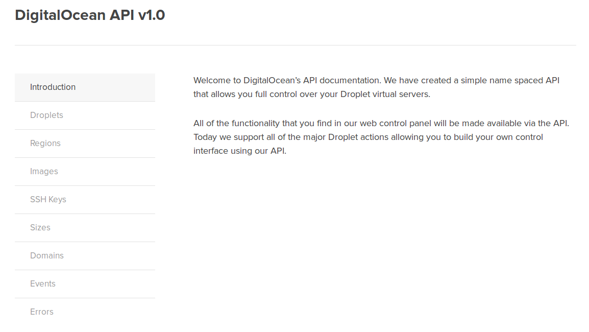

# Bonus : création de VPS via le module digital_ocean de Ansible

Dans le dernier screencast de la série ansible, je paramètre 3 serveurs afin de préparer le terrain pour l'hébergement d'une application web en mode **3-tier**. Ces 3 serveurs sont hébergés chez [DigitalOcean](https://digitalocean.com), qui propose une API implémentée dans un module standard que je vous propse de découvrir dans ce screencast bonus à la série Ansible.

## Le module digital_ocean et l'API

Le documentation officielle nous précise les paramètres attendus du module. On remarque rapidement qu'il nécessite un certain nombre d'identifiants qu'il n'est pas possible d'obtenir via le module. Direction donc l'[API de DigitalOcean](https://developers.digitalocean.com/v1/).

Il va nous falloir d'une part notre ID client et notre clé API. Celles-ci s'obtiennent dans le [*dashboard* en ligne](https://cloud.digitalocean.com/api_access).

D'autre part, il va nous falloir les informations suivantes :

- ID de l'image souhaitée
- ID de la zone d'hébergement (US/Europe/etc.)
- ID de la taille souhaitée pour le VPS
- ID de notre clé SSH enregistrée dans le *dashboard*

Merci l'API REST de nous fournir ces éléments. Suivant les exemples fournis, j'obtiens ces renseignements que je m'empresse d'ajouter dans un fichier `do_info.yml`.

J'utilise pour cela `curl` en ligne de commande, ainsi qu'un [parser Json](http://stedolan.github.io/jq/) appelé `jq`.

    $ CLIENT_ID=XXXXXXXXXXXXXXXXXXX
    $ API_KEY=YYYYYYYYYYYYYYYYYYYYY
    $ URL="https://api.digitalocean.com/v1/"
    $ echo "image_id:"   $(curl -s -X GET "$URL/images/?client_id=$CLIENT_ID&api_key=$API_KEY"   | jq '.images[] | select(.name=="Ubuntu 14.04 x64") | .id') > do_info.yml
    $ echo "size_id:"    $(curl -s -X GET "$URL/sizes/?client_id=$CLIENT_ID&api_key=$API_KEY"    | jq '.sizes[] | select(.name=="512MB") | .id') >> do_info.yml
    $ echo "region_id:"  $(curl -s -X GET "$URL/regions/?client_id=$CLIENT_ID&api_key=$API_KEY"  | jq '.regions[] | select(.slug=="ams2") | .id')  >> do_info.yml
    $ echo "ssk_key_id:" $(curl -s -X GET "$URL/ssh_keys/?client_id=$CLIENT_ID&api_key=$API_KEY" | jq '.ssh_keys[] | select(.name=="bobmaerten") | .id') >> do_info.yml

J'aurais également besoin de ma clé API et de mon identifiant client, toutefois ces informations étant personnelles, je ne souhaite pas les laisser en clair dans un fichier texte.

Heureusement ansible propose la fonctionalité `vault` permettant de chiffer et de protéger un fichier avec un mot de passe.

    $ ansible-vault create do_personnal_vars.yml
    Vault password: **********

Nous voici prêt a écrire le playbook qui créera les serveurs sur le cloud DigitalOcean.

    $ cat create_do_servers.yml
    ---
    - hosts: localhost
      gather_facts: false
      vars_files:
        - do_info.yml
        - do_personnal_vars.yml
      vars:
        - servers:
          - webserver
          - dbserver
          - reverseproxy
      tasks:
        - name: Create server on digitalocean
          digital_ocean: >
            command=droplet
            name={{ item }}
            client_id={{ client_id }}
            api_key={{ api_key }}
            size_id={{ size_id }}
            region_id={{ region_id }}
            image_id={{ image_id }}
            ssh_key_ids={{ ssh_key_id }}
            private_networking=yes
            unique_name=yes
            wait=no
          with_items: servers

J'utilise ici une variable `servers` qui me permet de n'écrire une seule tâche et d'utiliser une boucle ansible avec `with_items`.

Reste à lancer ce playbook. Comme nous avons un fichier yml chiffré, il faut préciser la directive `--ask-vault-pass`. Pas besoin de préciser de ficheir d'inventaire car le playbook s'exécute en local. Rappelez vous la dépendance avec le module python `dopy` que nous installons juste avant.

    $ pip install dopy
    Downloading/unpacking dopy
      Downloading dopy-0.3.0.tar.gz
      Running setup.py (path:/home/rmaerten/build/dopy/setup.py) egg_info for package dopy

    Requirement already satisfied (use --upgrade to upgrade): requests>=1.0.4 in /home/rmaerten/lib/python2.7/site-packages (from dopy)
    Installing collected packages: dopy
      Running setup.py install for dopy

    Successfully installed dopy
    Cleaning up...
    $ ansible-playbook create_do_servers.yml --ask-vault-pass
    Vault password: ******

    PLAY [localhost] **************************************************************

    TASK: [Create server on digitalocean] *****************************************
    changed: [localhost] => (item=webserver)
    changed: [localhost] => (item=dbserver)
    changed: [localhost] => (item=reverseproxy)

    PLAY RECAP ********************************************************************
    localhost                  : ok=1    changed=1    unreachable=0    failed=0

Mais créer juste les serveurs ne suffisait pas. Je voulais pouvoir y accéder directement et donc récupérer leurs adresses IP afin de les renseigner dans mon fichier `hosts` ainsi que dans les variables des rôles du screencast précédent. J'ai donc complété le playbook de la sorte.

    $ cat create_do_servers.yml
    ---
    - hosts: localhost
      gather_facts: false
      vars_files:
        - do_vars.yml
        - do_private_vars.yml
      vars:
        - servers:
          - webserver
          - dbserver
          - reverseproxy
      tasks:
        - name: Create server on digitalocean
          digital_ocean: >
            command=droplet
            name={{ item }}
            client_id={{ client_id }}
            api_key={{ api_key }}
            size_id={{ size_id }}
            region_id={{ region_id }}
            image_id={{ image_id }}
            ssh_key_ids={{ ssh_key_id }}
            private_networking=yes
            unique_name=yes
            wait=no
          with_items: servers
          register: droplets

        - name: update vars file in roles config
          lineinfile: >
            dest=./vars.yml
            create=yes
            regexp="^{{ item.droplet.name }}_internalip:"
            line="{{ item.droplet.name }}_internalip: {{ item.droplet.private_ip_address }}"
          with_items: droplets.results

        - name: copy vars.yml file in each role directories
          copy: >
            src=vars.yml
            dest=roles/{{ item.droplet.name }}/vars/main.yml
          with_items: droplets.results

        - name: update local /etc/hosts
          lineinfile: >
            dest=/etc/hosts
            regexp="\s*{{ item.droplet.name }}$"
            line="{{ item.droplet.ip_address }} {{ item.droplet.name }}"
          with_items: droplets.results
          sudo: yes

Je récupère ici le résultat du module digital_ocean dans une variable `droplets` et je l'utilise en tant que boucle à l'aide de `with_items: droplets.result`.

Enfin, et pour ne pas perdre trop de crédits sur DO, j'ai également créé un playbook pour supprimer ces droplets.

    $ cat remove_do_servers.yml
    ---
    - hosts: localhost
      gather_facts: false
      vars_files:
        - do_personnal_vars.yml
      vars:
        - servers:
          - webserver
          - dbserver
          - reverseproxy
      tasks:
        - name: Remove server on digitalocean
          digital_ocean: >
            command=droplet
            state=deleted
            name={{ item }}
            client_id={{ myclient_id }}
            api_key={{ myapi_key }}
            unique_name=yes
            wait=no
          with_items: servers

    $ ansible-playbook remove-do-servers.yml --ask-vault-pass
    PLAY [localhost] **************************************************************

    TASK: [Remove server on digitalocean] *****************************************
    changed: [localhost] => (item=webserver)
    changed: [localhost] => (item=dbserver)
    changed: [localhost] => (item=reverseproxy)

    PLAY RECAP ********************************************************************
    localhost                  : ok=1    changed=1    unreachable=0    failed=0

## Conclusion

C'est pour cet épisode bonus. Il exite bien d'autre modules ansible pour un tas d'environnement du net. N'hésitez pas à en expérimenter quelques uns, vous trouverez surement un intérêt dans vos workflow quotidiens.

Merci d'avoir suivi entièrement cette série, et à la prochaine fois sur un autre sujet.
